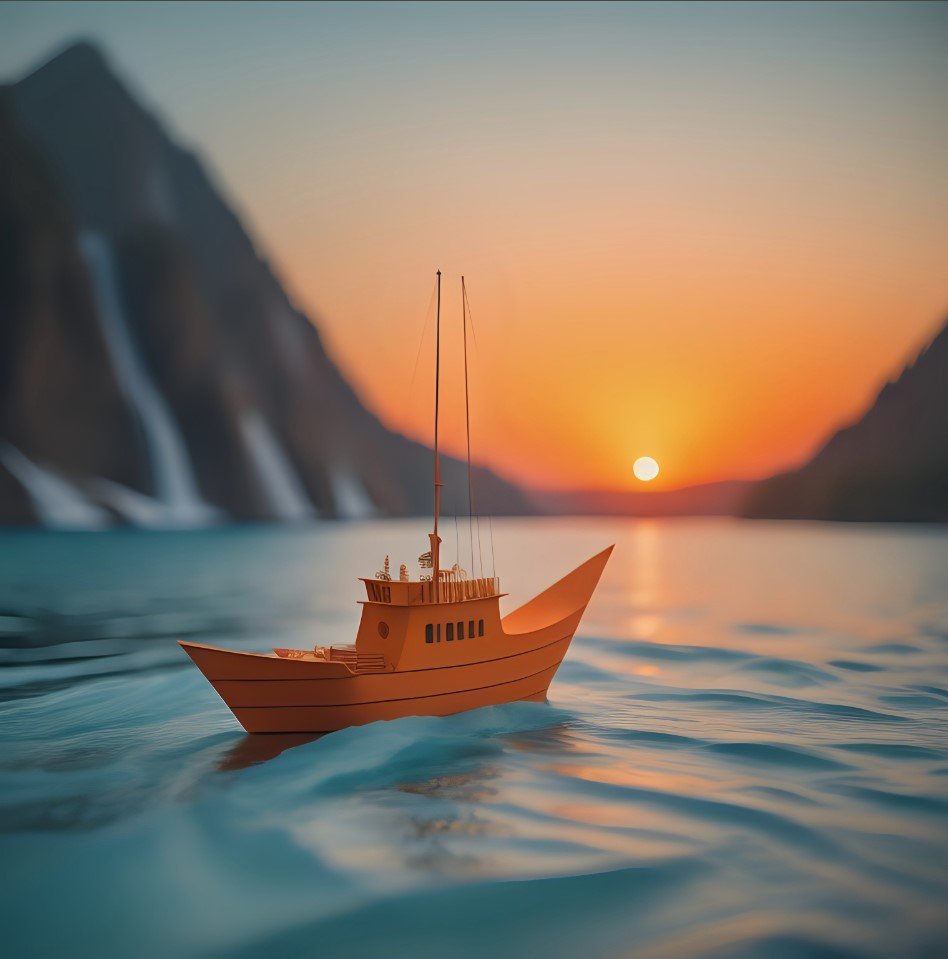

Из бумаги и палочек
сделанный
по реке 
быстротечной 
скользил
мой кораблик,
вобравший уверенно
песню ветра
и яркость
светил.

Он неспешно,
размеренно шёл,
любовался
погожими днями,
гордо выпячив
мачтовый ствол,
маневрируя меж 
островами.

Необъятным
был мир
и прекрасным,
без обид и
гордыни чернил.
Разрисованный
честными красками,
он раздольем
спокойным 
манил.

И кораблик
доверился полностью
воле волн, 
указателю звёзд.
Созерцал чудеса
с чистой совестью,
вдохновение
с палубой 
нёс.

Не страшны были
брызги и камни,
что цепляли 
настороженно 
дно,
Судно думало,
безопасно
путешествовать
в мире
таком.

И заслушавшись
звуками
пряными,
засмотревшись
на алый закат,
беззаботно
шло себе
прямо...

...а впереди
гремел
водопад...

22.03.2020

