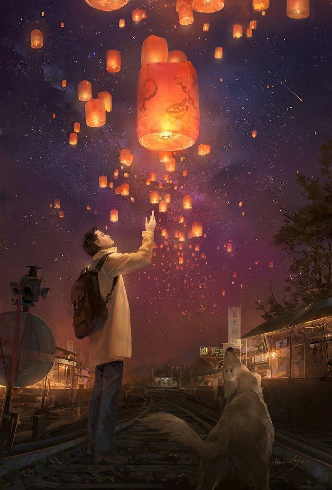

### Сочиняйте   
   
   
Сочиняйте простыми шагами,   
выбивая миллионы идей.   
Сочиняйте про чувства на гранях,   
про погромы в титановой высоте.   
   
Сочиняйте клубком мирозданий,   
про победы гремучих речей.   
Сочиняйте пустыми ночами,   
безобразно и гулко смелея.   
   
Сочиняйте рубины названий,   
озаряя фасад батарей.   
Сочиняйте скомканной сталью,   
разбросав карусель в пустоте.   
   
Сочиняйте миноры спиралей,   
разбавляя раствор новостей.   
Сочиняйте витыми стихами,   
теоремой в нелогичной среде.   
   
Сочиняйте тропинки следами,   
окунув футуризм в красоте.   
Сочиняйте,   
 пожалуйста,   
 сами,   
пока можете   
 перекрашивать   
 тень.  
  
  
  
29.11.2020

