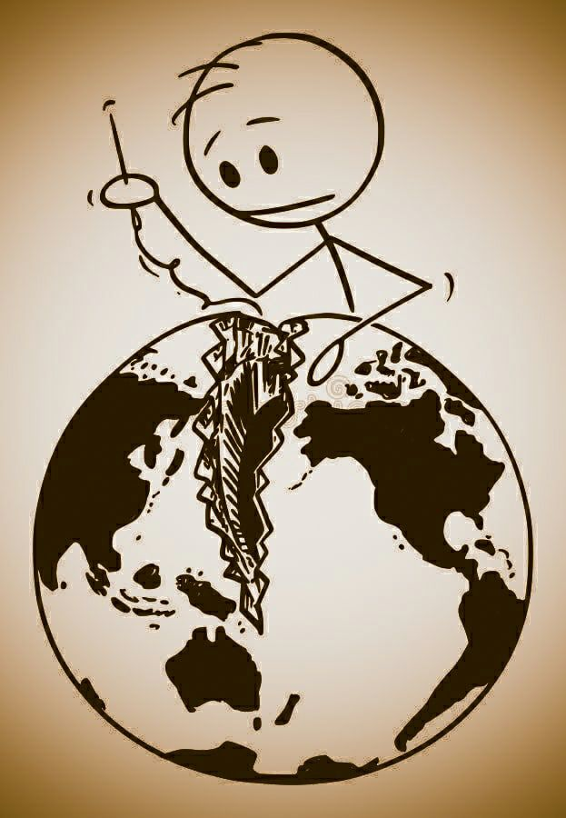

### Не врите  
  
Не врите,  
вращая пафосно суть,  
не плавайте  
в лестных морях.  
Оставьте ложь  
для телевизионных студий,  
она эскалатор   
во мрак.  
  
Кричите,  
шаблонов срывая ткань,  
не бойтесь  
грубить подлецам.  
Бросайте вызов  
стереотипным тайнам,  
ломайте их  
до конца.  
  
Глядите,  
соблазнов отрезав глас.  
Не красьте надуто   
себя.  
Прислушайтесь  
к дряхлым механизмы масс,  
что грузно и вяло  
гудят.  
  
Вкусите,  
общаясь начистоту,  
примите  
печальную явь.  
Не ждите,  
надежд воздвигая орду:  
распилят,  
на честь наплевав.  
  
Усвойте  
масштабы подлых орудий,  
признайте  
вселенскую силу.  
Помните:  
  
все мы  
неидеальные люди  
в большом  
неидеальном мире.  
  
  
  
02.05.2021  
