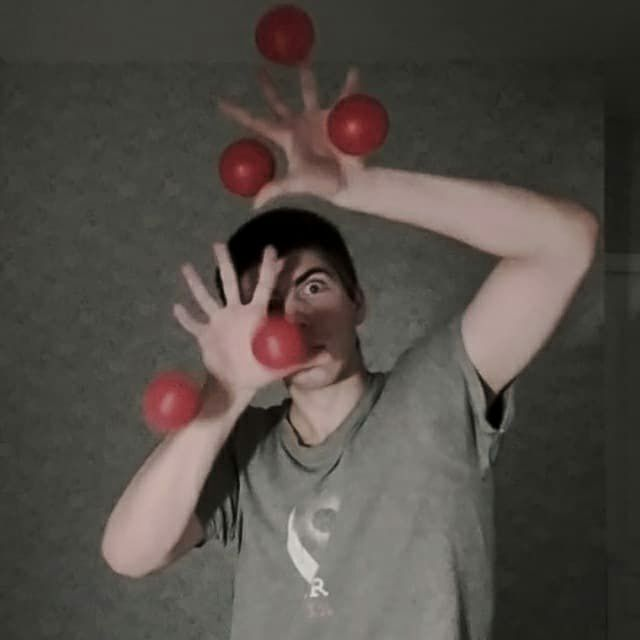
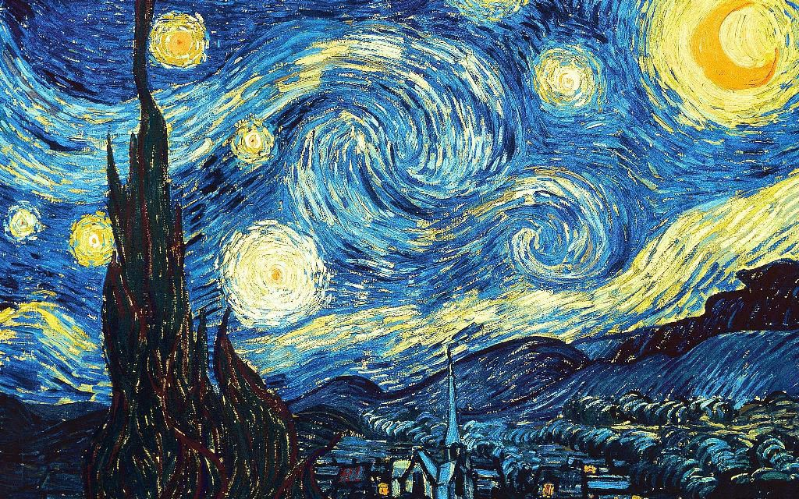
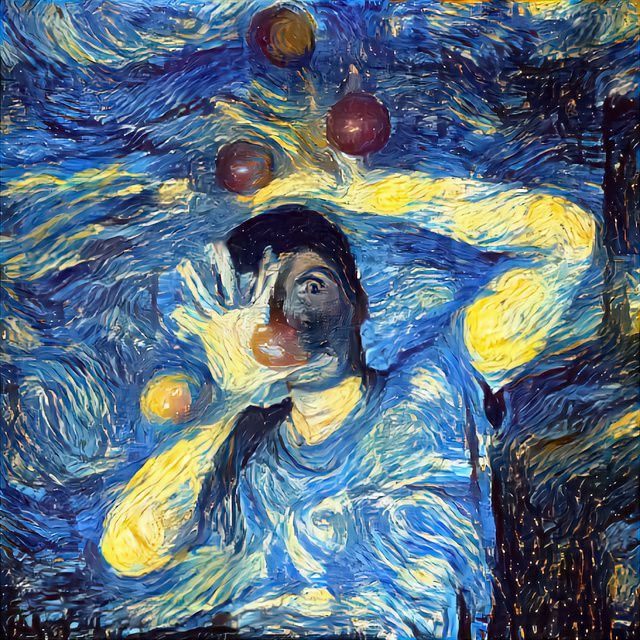

Иногда прямо таки обидно становится, ну в самом деле...

Моя фотка             |  Звёздная ночь
:-------------------------:|:-------------------------:
  |  

Это не магия, это математика.

Изображение из записи создано с помощью генеративной нейросети на основе прикреплённых ниже оригинала и картины Ван Гога "Звёздная ночь". Сам я такое пока не реализовывал, но очень вдохновился этой темой и когда-нибудь ей точно займусь.

А пока вот ссылка на репозиторий Katherine Crowson c запускабельным ноутбуком (Google Colab), который позволяет генерировать похожие вещи за пару минут.

https://github.com/crowsonkb/style-transfer-pytorch

Можно (нужно) накидать звёздочек таким людям.

