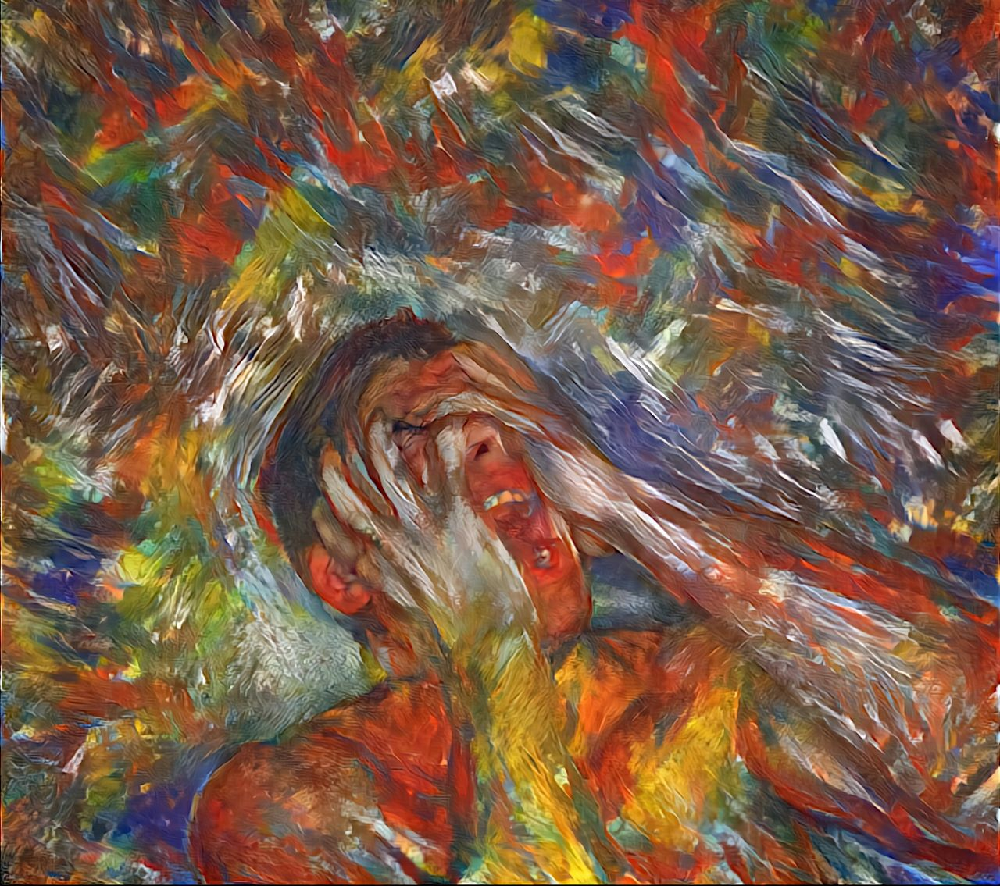

### Зноý

Зноý   
дзяручыя весткi  
разбiваюць архiвы  
планаý,  
забiраючы  
па адрэзках  
звыкласць  
знiклую  
нечакана.  
  
Лезе ý мозг  
скрозь   
надзеi апоры  
дым сумнення,  
дурных прыкметаý.  
Льецца  
па душы калiдоры  
скавытанне  
сацыяльных   
сетак.  
  
Цяжка думаць,  
бо гэта не першы  
разразальных  
навiнаý  
штык...  
  
У галаве  
не складаюцца  
вершы--  
толькi  
рознакаляровы  
крык.  
  
  
  
07.03.2022  
```
#мова
```

