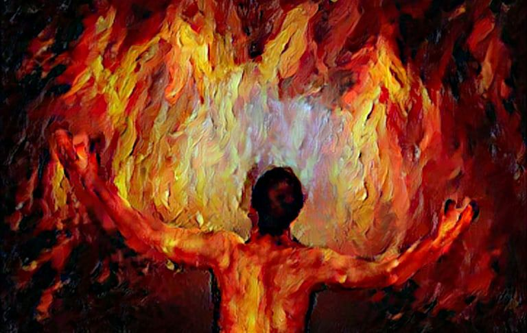

### Фенікс

Пад попелам  
разбураных будняý,  
пад шэрасцю   
кволай тугi  
прачнуцца  
сярод вязкага бруду  
агеньчыкi  
адзiн за адным.  
  
Цяпло iх   
нясмела мiгае,  
iх моц  
растварае iмгла.  
...але незабытая зграя  
збiраецца ý форме  
крыла.  
  
Збiраецца   
па-былому,  
па-свойму спяшаецца жыць:  
адхiнуýшы iлюзiю стомы,  
ламае   
маркоты мяжы.  
  
Збiраецца  
па крупiнках,  
па рэштках вясновых надзей,  
без недакамфортных прыпынкаý  
шукаючы сэнс у цемнаце...  
  
I яркiм яднаецца птахам  
адказнасцi вечны агонь:  
  
скрозь гушчу   
звыклага страху  
адчуецца цвёрдае  
"сёння".  
  
Сёння   
будзе мой панядзелак!  
Сёння   
будзе ýзлёт дагары!  
Сёння   
я рухавы i смелы!  
Сёння   
хворая недарэчнасць згарыць!  
  
Сёння  
я адраджаюся  
фенiксам  
  новай  
    пары!  
  
  
  
06.06.2022  
```
#мова
```
