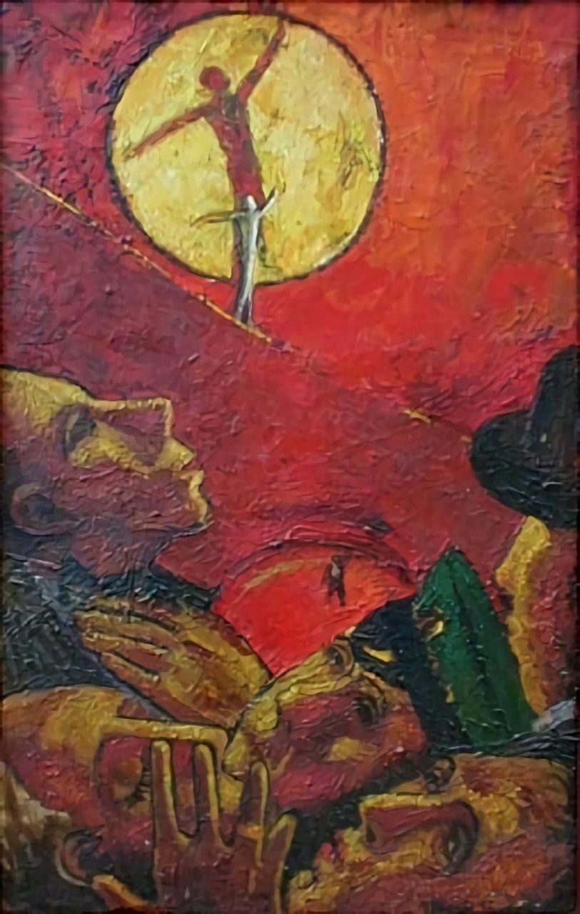

### Люди

Намозолен слух  
пустовялой критикой  
и изрезаны соцсетями   
нервы.  
Нынче моду вещают нам  
люди-нытики,  
не без помощи  
людей-консервов.  
Их туманной,  
бардачной лирике  
я не внемлю по тонне причин.  
Захочу посмеяться—  
к человеку-сатирику,  
а не к жалобам  
людей-сардин.  
Слышишь?  
Текут  
антисептиком  
безучастные,  
мёрзлые вздохи.  
Это хмурятся  
люди-скептики  
или   
люди-"о, как всё плохо".  
Разбираются  
кости печали,  
и бездельем глаза   
дребезжат.  
То отряды  
людей-кричалок  
бесполезных,  
как хвост ежа.  
Есть ещё человек-"не буду",  
а за ним человек-"не моё".  
Их несложно заметить   
всюду,  
где есть риски,   
труд   
и новьё.  
  
Томно!  
В этом  
кисельном море  
из бессвязной толпы частиц  
я ищу  
не людей-санаториев,  
а людей-испытателей лица.  
  
Заплывая  
за буй комфорта  
и чужое отбросив "надо",  
гимнами  
громогласят гордо  
люди-чувства   
и люди-каскады!  
Все боятся   
(ведь это нормально)  
и открытых,  
и душевных ран.  
Покоряется им  
человек маленький—  
не послушает  
человек-барабан!  
А под смогом  
штампованных мнений,  
среди лжи и людей-зевак,  
Точно ходит недопонятый гений,  
точно светит человек-маяк!  
Их немного,   
но они похожи:  
инвестируют в дофамин.  
Прошагает жизнь  
человек-прохожий,  
а нырнёт в неё  
человек-дельфин!  
  
Подытожив  
насущные истины  
и   
шаблонные перечеркнув  
придирки,  
признаюсь:  
  
я устал   
от людей   
неискренних,  
а любимый тип—  
люди-цирки!  
  
  
  
27.06.2022  
