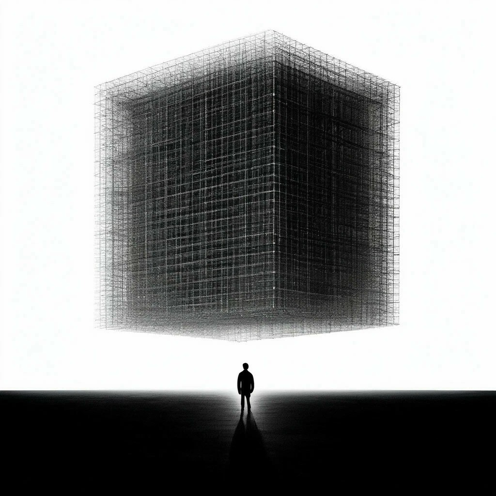

### Дилемма 

Я пытался   
составить формулу,  
по которой "правильно" жить.  
Я считал  
"моральные" нормы,  
выводил интегралы "души".  
Я хотел   
разработать теорию  
абсолютно "этичных" взглядов.  
Я искал  
производную "совести",  
центр "истинных" координат.  
Я блуждал  
по параболам "правды",  
приближал "человечность" кривыми.  
Я не спал,  
но в поисках равенств  
я оформил   
несложный вывод:  
  
Если вы   
многомерность мира  
ужимаете  
в призму   
простую,  
  
то сперва,  
пожалуйста,  
докажите,  
что последняя  
вообще  
существует.  

11.06.2024

